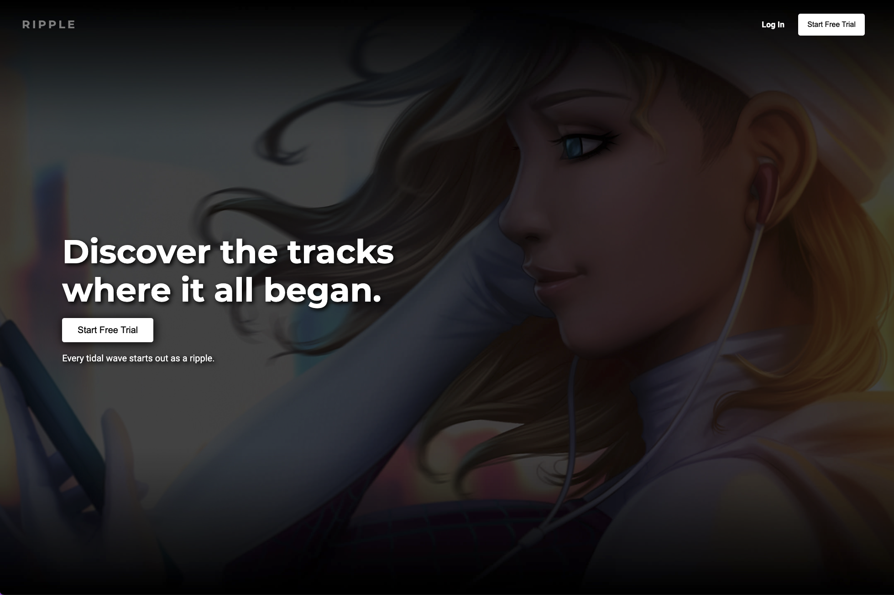
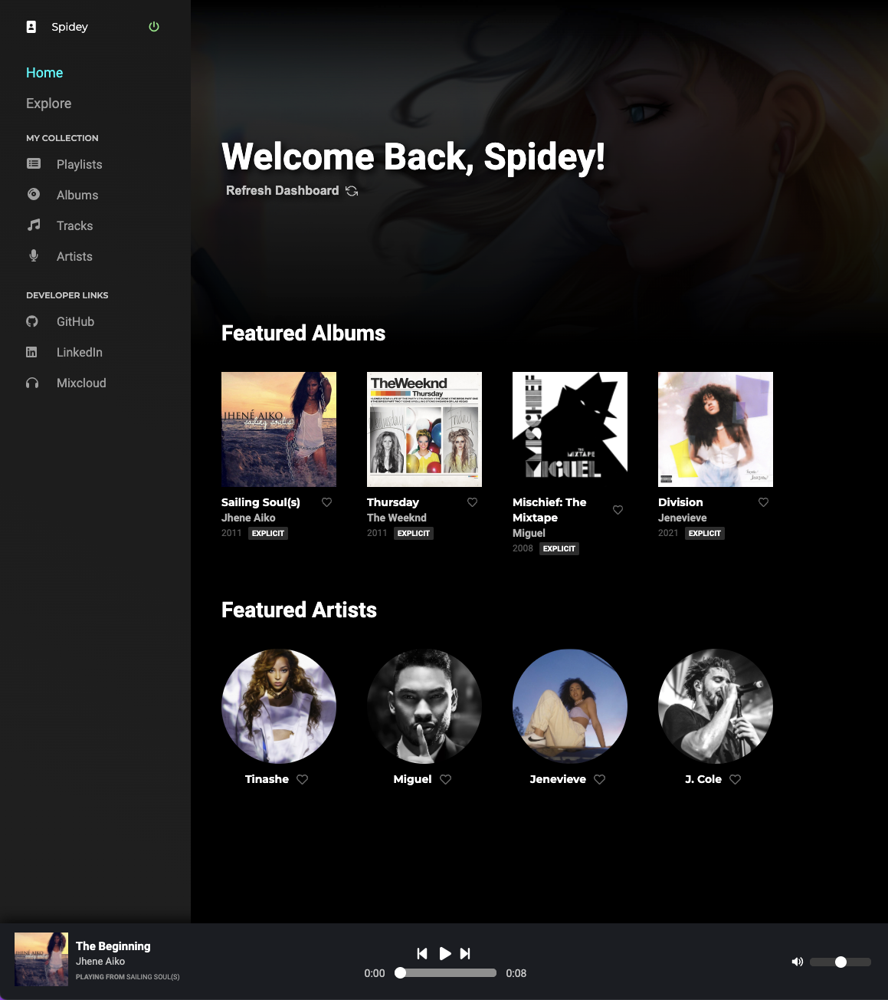
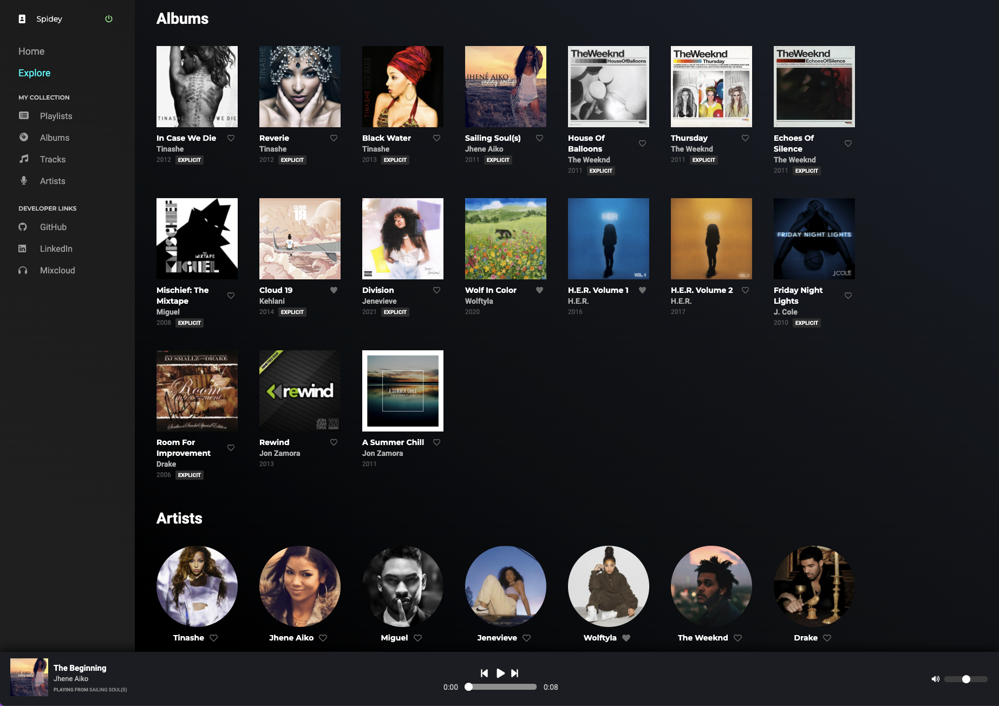
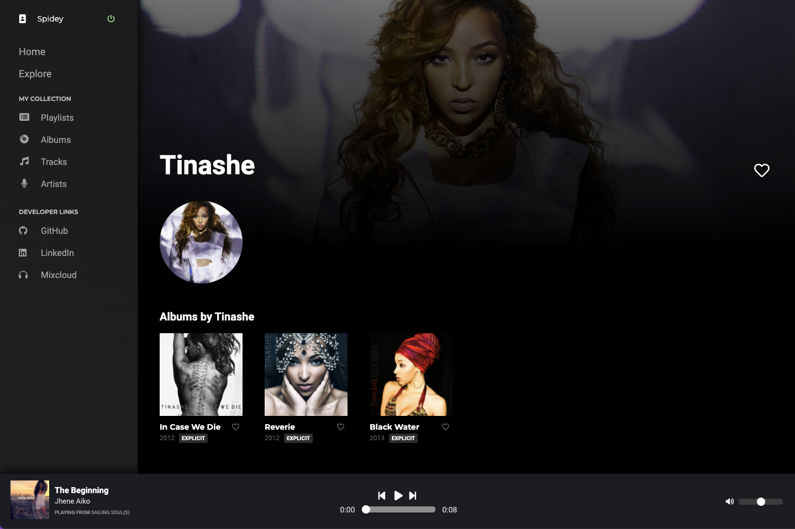
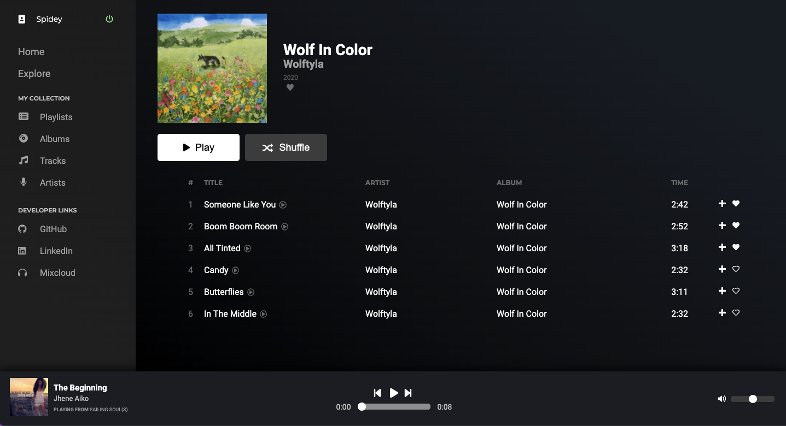
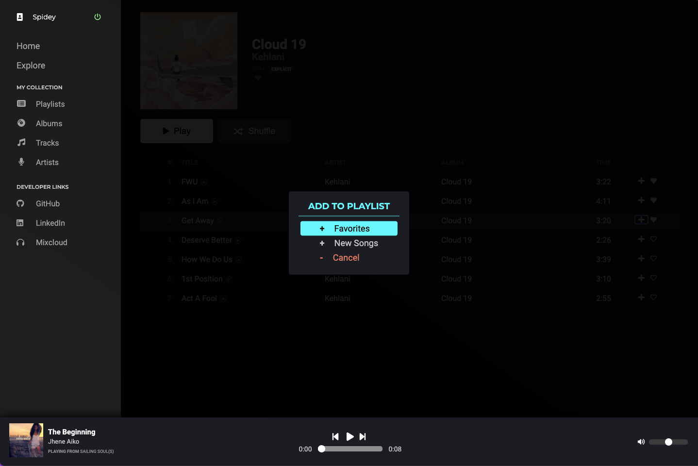

[View Ripple](https://ripple-music-jz.herokuapp.com)

# Ripple

## About

Ripple sets out to emulate popular music streaming sites such as Tidal and Spotify with the added caveat of having a library composed of the early works of popular and new up-and-coming artists as well. Users can stream music, create their own playlists, like albums and tracks, and follow artists.

## Image Walkthrough



Once logged in, users are presented with a random selection of featured albums and artists.



The explore section showcases all albums and artists that are currently loaded on the site.



Selecting artists will reveal their albums.



Selecting albums will show the tracklist which users can play.



Individual tracks can be added onto the user's playlists via modal.

## Feature Descriptions
1. While browsing through album pages, users are presented with '+' buttons on each track that allow for a modal to appear where users can select which playlist to add on to.
2. While viewing selected playlists, users can easily remove tracks by clicking on the '-' button associated with the track.
3. Users can click on corresponding 'heart' buttons to mark that album, track, or artist as a favorite. Favorites will show up in the My Collection sections.
4. Pressing play on a song will load it on to the player along with the entire album or playlist.
 
## Development Information

### Technologies Used

BackEnd | Frontend
---|:--
Ruby on Rails | React
PostgreSQL | Redux
AWS S3 | JavaScript ES6
jbuilder | React Hooks

### Notable Code Snippets

```javascript
handleLike() {
  if (!!likedAlbums[albumId]) {
    deleteAlbumLike(likedAlbums[albumId]);
  } else {
    postAlbumLike({userId: currentUserId, albumId: albumId});
  }
}
```

* By storing the key-value pair of a user's liked-track's ID with the specific track ID, I was able to make the boolean check for likes much more efficient on view.

### Future Additions

* Add a queue display for the current playlist.
* Indicate a track is playing while on the album show page.
